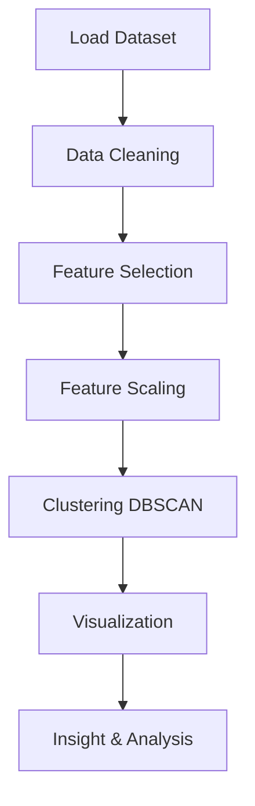

Berikut versi **README GitHub yang lebih keren** dengan banner, badge, dan elemen visual modern. Ini siap langsung kamu copy ke `README.md` 🚀

---

# ⚽ Football Match Analytics (EPL)

### 🤖 AI & Big Data Project

<p align="center">
  
  
  
  
  
</p>

---

## 🎥 Project Preview (GIF)

<p align="center">
  
</p>

---

## 📌 Overview

Proyek ini berfokus pada analisis data pertandingan **English Premier League (EPL)** menggunakan pendekatan **Artificial Intelligence & Big Data**.

Berdasarkan materi dalam laporan proyek , sistem ini menggunakan:

* **Machine Learning (Unsupervised Learning)**
* **Anomaly Detection**
* **DBSCAN Clustering**

🎯 Tujuan utama:

* Mengidentifikasi pola performa tim
* Menemukan tim dengan performa tidak biasa (anomali)
* Memberikan insight berbasis data

---

## 🧠 Key Concepts

### 🤖 Machine Learning

Model belajar dari data tanpa aturan eksplisit untuk menemukan pola tersembunyi.

### 🔍 Unsupervised Learning

Digunakan untuk:

* Clustering
* Pattern discovery
* Anomaly detection

### 🚨 Anomaly Detection

Menemukan tim dengan:

* Performa ekstrem (tinggi / rendah)
* Pola yang menyimpang dari mayoritas

### 📊 DBSCAN Algorithm

* Density-based clustering
* Tidak perlu jumlah cluster di awal
* Mendeteksi outlier secara otomatis

---

## ⚙️ Workflow



---

## 📊 Exploratory Data Analysis


📈 Analisis yang dilakukan:

* Distribusi hasil pertandingan (Home / Away / Draw)
* Perbandingan gol kandang vs tandang
* Distribusi gol (density)
* Rata-rata gol per musim
* Analisis kartu (yellow & red cards)
* Top 10 tim dengan kemenangan terbanyak
* Analisis shots (tembakan)
* Korelasi statistik pertandingan (heatmap)

---

## 📉 Sample Visualization


---

## 🛠️ Tech Stack

<p align="center">
  
</p>

* Python
* Pandas
* NumPy
* Matplotlib / Seaborn / Plotly
* Scikit-learn

---

## 📂 Project Structure

```bash
football-analytics-epl/
│
├── data/
│   └── epl_dataset.csv
│
├── notebooks/
│   └── analysis.ipynb
│
├── visuals/
│   └── charts.png
│
├── models/
│   └── dbscan_model.pkl
│
└── README.md
```

---

## 👥 Team Members

| Name                  | ID           |
| --------------------- | ------------ |
| Jonathan Kolibu       | 101012330092 |
| Aldora Rian Perdana   | 101012300289 |
| David Binsar S        | 101012300017 |
| Ahmad Naufal Romadhon | 101012300081 |
| Raga Fath Syahputra N | 1101223132   |

---

## 🚀 Key Insights

✔ Tim dengan performa ekstrem dapat dideteksi menggunakan DBSCAN
✔ Data pertandingan mengandung pola tersembunyi yang tidak terlihat secara manual
✔ AI membantu pengambilan keputusan berbasis data dalam olahraga

---

## ⭐ Future Improvements

* Integrasi real-time data API
* Model prediksi hasil pertandingan
* Dashboard interaktif (Streamlit / Power BI)

---

## 📎 Dataset

Dataset: English Premier League Match Data
